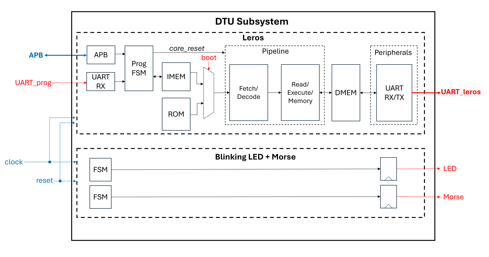
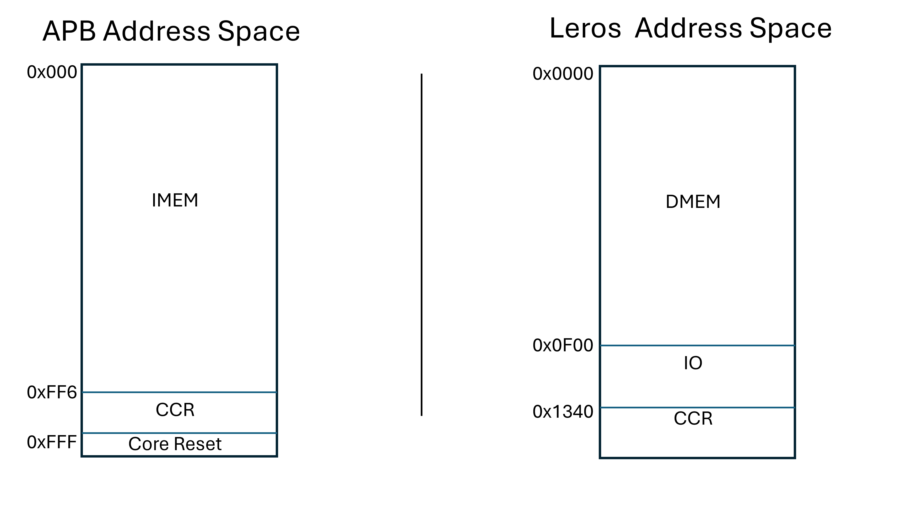

# DTU Subsystem Edu4Chip
The project at DTU is a small 32-bit processor, called Leros. Leros is a tiny processor core for embedded systems. 
See more documentation on the [website for Leros](https://leros-dev.github.io/). 

The instruction memory shall be loaded from the IBEX over the APB interface. Alternatively Leros can execute from a ROM. Which source Leros boots from is selectable using `bootSel`.
Leros a UART interface and 4 GPIOs, this are distributed on two rows of PMOD connectors. 

## Instructions
Note that this project includes Leros and a tiny FSM as submodules. Therefore, you need to update with:

```
git submodule update --init --recursive
```

## Diagram


Red signals are IOs connected to the PMOD connector. Blue signals are IOs between DTU subsystem and staff area. Arrows marked with **bold** denote a bus interface.  
Cross Core Registers (CCR) facilite communication between Leros and Ibex. They consist of two sets of registers, the first set is readable from APB and writeable from Leros, the second set is writeable from APB and readable from Leros. For now system features 8x cross core registers (4x in each direction). Cross core registers are 8-bit wide. 

## Pin Table

| Name              | Direction           | Function                   |PMOD Location
| ------------------| --------------------| -------------------------- |--------------
| `clock`           | input               | clock                      | N/A
| `reset`           | input               | reset signal (active high) | N/A
| `P<signal>`       | input/output        | APB interface              | N/A
| `irq1`            | output              | Interrupt                  | N/A
| `irqEn1`          | input               | Interrupt enable           | N/A
| `ssCtrl1`         | input               | --                         | N/A
| `bootSel`         | input               | select boot source         | `pmod0[0]`
| `uart_rx`         | output              | Leros UART interface       | `pmod0[1]`
| `uart_tx`         | input               | Leros UART interface       | `pmod0[2]`
| unused            | --                  | --                         | `pmod0[3]`
| `gpio[0]`         | input/output        | Leros GPIO                 | `pmod1[0]`
| `gpio[1]`         | input/output        | Leros GPIO                 | `pmod1[1]`
| `gpio[2]`         | input/output        | Leros GPIO                 | `pmod1[2]`
| `gpio[3]`         | input/output        | Leros GPIO                 | `pmod1[3]`


Currently `irq1`, `irqEn1` and `ssCtrl1` are unused. `irq1` is tied to 0. 

## Memory Map



