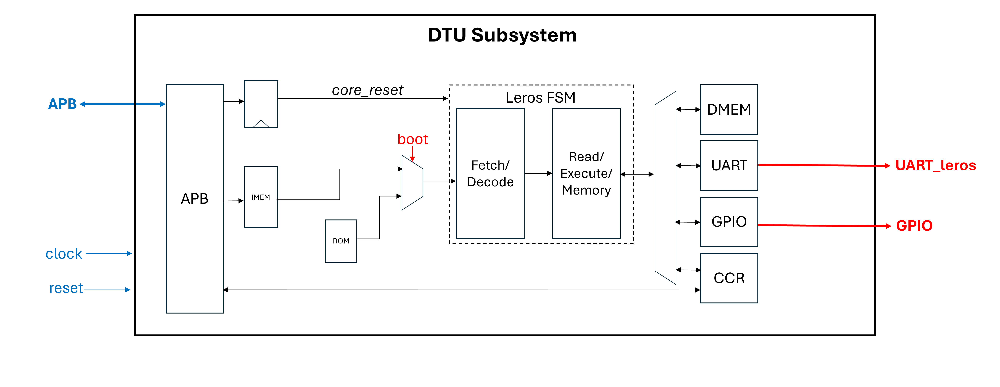

# DTU Subsystem Edu4Chip
The project at DTU is a small 32-bit processor, called Leros. Leros is a tiny processor core for embedded systems. It features a two-stage pipeline. The first stage fetches an instruction and decodes it, the second stage reads operands from data memory and executes the instruction. 
See more documentation on the [website for Leros](https://leros-dev.github.io/). 

The instruction memory shall be loaded from the IBEX over the APB or over UART (115200 baud/s) interface, this is selectable using `boot` pin. Leros will be connected to the two PMOD connectors (`pmod0` and `pmod1`, each pmod connector has 4 pins). 
Leros peripherals are memory mapped, for now it features a simple UART RX/TX interface operating at baudrate of 115200 baud/s. 

Besides Leros, the DTU subsystem will also have a tiny FSM to blink and beep "Hello World" in Morse code. These are independent from Leros. 


## Diagram


Red signals are IOs connected to the PMOD connector. Blue signals are IOs between DTU subsystem and staff area. Arrows marked with **bold** denote a bus interface.  

## Pin Table

| Name              | Direction           | Function                   |PMOD Location
| ------------------| --------------------| -------------------------- |--------------
| `clock`           | input               | clock                      | N/A
| `reset`           | input               | reset signal (active high) | N/A
| `P<signal>`       | input/output        | APB interface              | N/A
| `irq1`            | output              | Interrupt                  | N/A
| `irqEn1`          | input               | Interrupt enable           | N/A
| `ssCtrl1`         | input               | --                         | N/A
| `boot`            | input               | select boot source         | `pmod0[0]`
| `uart_rx_prog`    | input               | UART program interface     | `pmod0[1]`
| `uart_tx_leros`   | output              | Leros UART interface       | `pmod0[2]`
| `uart_rx_leros`   | input               | Leros UART interface       | `pmod0[3]`
| `led`             | output              | Led output                 | `pmod1[0]`
| `morse`           | output              | Morse output               | `pmod1[1]`


Currently `irq1`, `irqEn1` and `ssCtrl1` are unused. `irq1` is tied to 0. 

##  

## Instructions
Note that this project includes Leros and a tiny FSM as submodules. Therefore, you need to update with:

```
git submodule update --init --recursive
```
## Todo 
 - [x] Add CI
 - [x] Testing in an FPGA
 - [ ] Add instructions on how to compile programs for Leros
 - [ ] Add instructions on how to boot Leros
 - [ ] Add documentation on Leros program loading


